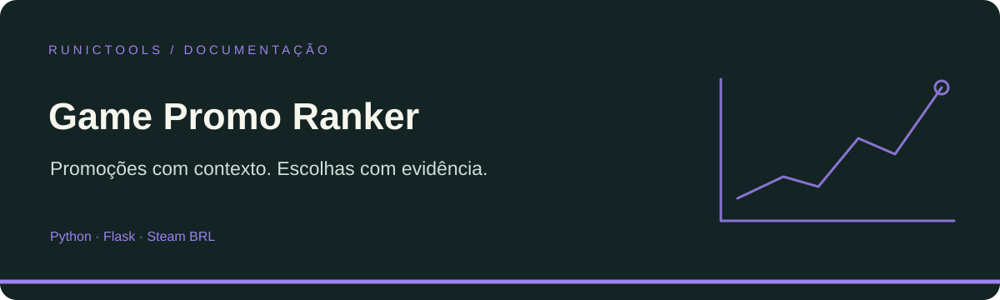

<div align="center">



# Game Promo Ranker

### Promoções com contexto. Escolhas com evidência.

Descubra jogos em promoção, acompanhe preços e consulte lançamentos, financiamento coletivo e eventos em um radar alimentado por coletores independentes.

[Começar](#comece-aqui) · [Recursos](#o-que-você-encontra) · [Arquitetura](#como-o-projeto-se-organiza) · [Documentação](#documentação)

</div>

## O que você encontra

- Ranking Steam que combina Wilson95, volume de avaliações, desconto e histórico regional.
- Preço observado em BRL separado de mínima histórica importada; cobertura e validade visíveis.
- Filtros, favoritos no navegador, catálogo Game Pass, ofertas Epic, jogos grátis e agenda.

## Comece aqui

Os comandos partem da raiz de um clone deste repositório, salvo quando incluem o próprio clone.

```sh
python -m venv .venv
# Ative .venv no seu sistema antes dos comandos seguintes.
python -m pip install -r requirements.txt
python refresh_daily.py --pages 20 --data-dir data
python app.py
```

Abra http://localhost:8000. A coleta acessa serviços externos e pode demorar ou falhar parcialmente. O servidor de desenvolvimento usa debug e não deve ser exposto à internet.

## Como o projeto se organiza

| Caminho | Responsabilidade |
| --- | --- |
| [app.py](app.py) | Rotas Flask e leitura dos snapshots. |
| [refresh_daily.py](refresh_daily.py) | Orquestra coletores e registra a situação de cada fonte. |
| [steam_sale_ranker.py](steam_sale_ranker.py) | Coleta e pontuação das promoções Steam. |
| [price_history_store.py](price_history_store.py) | Persistência do histórico de preços. |
| [index.html](index.html) | Interface; complementada por static/. |
| [deploy/ship.ps1](deploy/ship.ps1) | Entrega orquestrada; não necessária para leitura local. |

## Configuração e dados

Snapshots e histórico vivem em `data/`. Agende `refresh_daily.py` no ambiente de execução; abrir a página não executa todo o catálogo. Uma primeira observação local não comprova a mínima histórica. Wishlist pública pode ser consultada sem chave; biblioteca possuída usa chave Steam opcional, que não deve ser salva em URLs compartilhadas.

## Verificação

```sh
python -m unittest discover
# No ambiente Windows configurado:
./deploy/ship.ps1 -NoDeploy
```

Os comandos acima são os pontos de verificação do projeto, não uma declaração de execução nesta revisão documental. Consulte os requisitos de cada ferramenta antes de rodá-los.

## Limitações e cuidados

Fontes podem restringir consultas ou publicar dados incompletos. O ranking não mede qualidade absoluta. Compare apenas a mesma edição, região e moeda; assinaturas são acesso temporário, não compra. O guia técnico detalha as janelas de validade e a diferença entre preços observados e históricos.

## Documentação

- [Guia de manutenção e operação](docs/PROJECT_GUIDE.md)
- [Guia técnico detalhado](GUIDE.md)

O banner é uma composição vetorial original de documentação; não é uma captura da aplicação nem uma marca oficial de terceiros.
